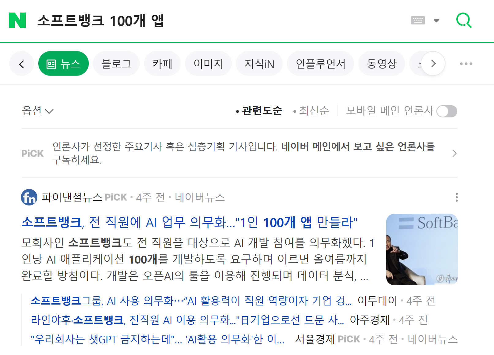
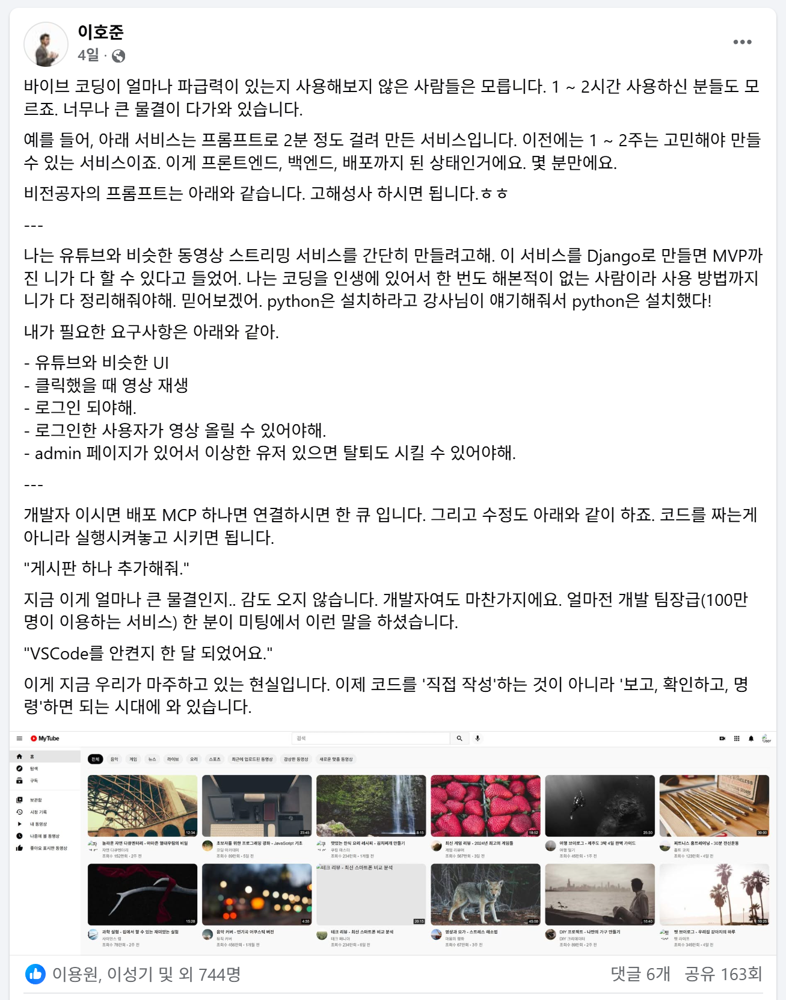
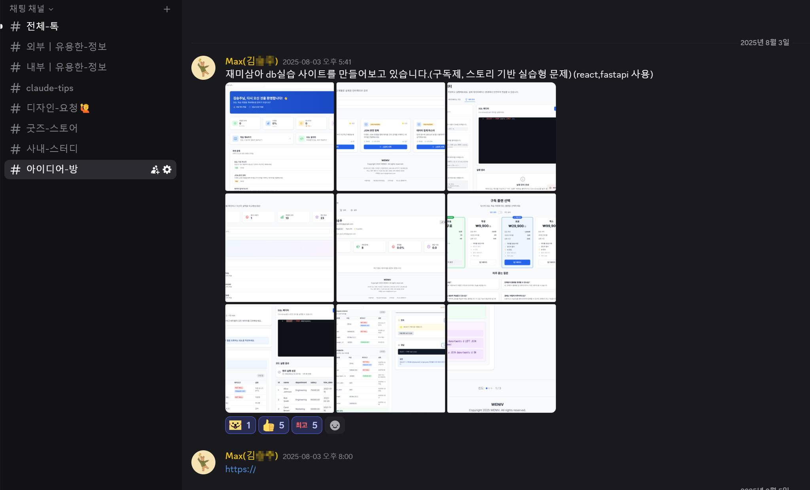
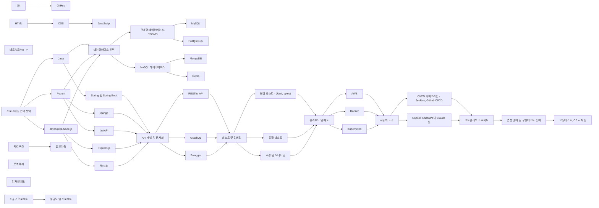

# backend-developer-guide
- 이 가이드는 가이드일 뿐입니다. 통계, 장단점, 시장 등의 요소 보다는 가능하다면 좋아하는 것을 하시길 권하드립니다. 프로그래밍 언어를 선택하고 프레임웤을 선택하는 것은 단지 그것을 '도구'로서 활용한다는 것이 아닙니다. 여러분의 생각을 일깨우고, 확장하고, 구체화하는 '생태계'입니다. 그래서 꼭 자신에게 맞는 옷을 입어야 합니다. 그 생태계 저변에 깔려있는 철학이 자신에게 맞는 것인지 확인할 필요가 있습니다.

- 좋아하는 것을 선택해서 먹고 살수 있는가에 대해 먼저 얘기하겠습니다. 제주에는 스칼라를 참 좋아하는 유명한 프로그래머가 한 분 있으세요. 다만 국내에는 스칼라로 프로그래밍을 할 수 있는 곳이 많지 않죠. 다만 그래도 길을 찾아가시더라고요. 심지어 이 분을 위해 회사에서 그 언어를 채택한 경우도 있었고요. 좋아하는 것을 하면, 좋아하는 것으로 먹고 살 수 있습니다. 단, 당연히 실력이 있어야죠.

- 물론 항상 이렇게 좋아하는 것만 선택할 수는 없습니다. 이 분도 자바 프로그래머로 상당히 오랜 기간 근무를 하셨습니다. 다만 이게 항상 양자 택일의 문제는 아니에요. 저희 회사만 하더라도 언어는 4개, 프레임웤도 5개 정도 사용하고 있으니까요. 여러분 상황에 맞게 넓게 보셨으면 좋겠습니다.

- 동의할 수 없는 글이 나온다면 여러분의 말이 옳습니다. 그렇다고 제 얘기가 틀린 것은 아니에요. 각자의 방식이 다른 것이니까요. 그러한 관점에서 이 글을 비판적으로 바라보셨으면 좋겠습니다.

- 이 강의는 아래 과정과 연결되어 있습니다.
  - [부트캠프 참여 전 반드시 알아야 할 모든 것](https://github.com/weniv/BootcampEssentials)
  - [프론트엔드 개발자 가이드](https://github.com/weniv/frontend-developer-guide)
  - [백엔드 개발자 가이드](https://github.com/weniv/backend-developer-guide)

## 0. 목차

- 1. 배우는 순서
- 2. 추천 기술 스택
  - 2.1. 통계자료
  - 2.2. 프로그래밍 언어
    - 2.2.1. Java
    - 2.2.2. Python
    - 2.2.3. JavaScript(Node.js)
  - 2.3. 데이터베이스
    - 2.3.1. 관계형 데이터베이스 (RDBMS)
      - 2.3.1.1. MySQL
      - 2.3.1.2. PostgreSQL
    - 2.3.2. NoSQL 데이터베이스
      - 2.3.2.1. MongoDB
      - 2.3.2.2. Redis
  - 2.4. 프레임워크 및 라이브러리
    - 2.4.1. Spring 및 Spring Boot (Java)
    - 2.4.2. Django 및 fastAPI (Python)
    - 2.4.3. Express.js 및 Next.js (Node.js)
  - 2.5. API 개발 및 문서화
    - 2.5.1. RESTful API
    - 2.5.2. GraphQL
    - 2.5.3. Swagger
  - 2.6. 버전 관리 시스템
    - 2.6.1. Git
    - 2.6.2. GitHub
  - 2.7. 테스트 및 디버깅
    - 2.7.1. 단위 테스트 (JUnit, pytest)
    - 2.7.2. 통합 테스트
    - 2.7.3. 로깅 및 모니터링
  - 2.8. 클라우드 및 배포
    - 2.8.1. AWS
    - 2.8.2. Docker
    - 2.8.3. Kubernetes
  - 2.9. 자동화 도구
    - 2.9.1. CI/CD 파이프라인 (Jenkins, GitLab CI/CD)
    - 2.9.2. (매우 중요) Copilot, ChatGPT나 Claude 등
- 3. 포트폴리오
  - 3.1. 프로젝트 선정
    - 3.1.1. 실무 관련성
    - 3.1.2. 기술적 도전
  - 3.2. 코드 품질
    - 3.2.1. 가독성 및 유지보수성
    - 3.2.2. 성능 최적화
    - 3.2.3. 테스트 커버리지
  - 3.3. 문서화
    - 3.3.1. README
    - 3.3.2. API 문서
    - 3.3.3. 데이터베이스 스키마
  - 3.4. 확장성 및 보안
    - 3.4.1. 스케일링 전략
    - 3.4.2. 인증 및 권한 부여
    - 3.4.3. 데이터 암호화
- 4. 면접 준비
  - 4.1. 기술 질문 대비
  - 4.2. 프로젝트 설명 연습
  - 4.3. 소프트 스킬 및 커뮤니케이션
  - 4.4. 커뮤니티 활동
  - 4.5. 스터디
  - 4.6. 책 출판
  - 4.7. 블로그 운영
  - 4.8. 유튜브 채널 운영
  - 4.9. 강의 제작
- 5. 지속적인 학습
  - 5.1. 최신 트렌드 파악
  - 5.2. 개인 프로젝트 및 실험
  - 5.3. 오픈소스 기여
- 6. 질의응답
 
## 0. 대 AI 시대의 현황

AI 기술의 발전으로 프론트엔드 개발자의 역할과 필요 역량이 변화하고 있습니다. 이제 아래와 같은 페이지는 디자이너가 가볍게 키워드 몇 개로 개발할 수 있는 시대가 되었어요.

* 링크: https://camp.weniv.co.kr/
* 랑크: https://vibe.weniv.co.kr/

얼마 전 소프트 뱅크의 손정희 회장은 1인당 100개의 앱을 만들라고 지시했습니다. 

어떻게 이런 일이 가능할까요?

이제 말 한마디에 앱이 만들어지는 시대가 되었습니다. 이러한 변화가 바꾸는 회사의 흐름은 아래와 같습니다.

이러한 시대에 우리는 어떻게, 무엇을 준비해야 할까요? 시대가 원하는 인재상은 무엇일까요? 시대가 원하는 '인재'는 있는 것일까요?

* 링크: https://www.job-ai.co.kr/

앞으로의 사람들은 어떤 역량을 갖추어야 할까요?

1. 회사에서 CTO(최고 기술 책임자) 역할을 하는 사람, 개인이 일을 하더라도 CTO와 같은 역할을 할 가능성이 매우 큼
    - 기술 스택을 결정하고, 아키텍처를 설계하고, 기술 부채를 관리하고, AI 팀을 이끌고, 프로젝트를 관리하는 역할
    - 비즈니스 목표를 설정하고, 작업 분배를 하고, 적절한 인풋과 아웃풋을 설정하고, 과하지 않은 기술을 채택하는 사람
    
2. AI를 활용하여 문제를 해결하거나 가치를 만들어내는 사람
    - 결과물에 가치를 발견하고 탐구하는 능력을 기르는 것이 매우 중요
    - 스스로 작업한 결과물에 대해 책임을 지고, 작업한 결과물에 대해 비즈니스적인 가치와 평가를 설명할 수 있는 사람

1번에 비추어보면 우리는 다양한 기술을 접목해볼 필요가 있습니다. 영역도 넓어져야겠지요. Front-end, Back-end 뿐만 아니라 디자인을 할 수 있는 역량도 필요합니다. 다만 두려워 할 것이 없습니다. 우리에겐 AI가 있으니까요.

2번에 비추어보면 '창업자' 교육이 각 개인마다 필요합니다. 코드에 비즈니스적 가치를 판단하고, 그 가치를 극대화할 수 있는 방법을 고민하는 역량이 필요합니다. 마케팅이나 기획 역량도 중요하게 되겠죠.

그렇다면 우리는 어떻게 준비해야 할까요? 많이 만들어봐야 합니다. 많이 시도해봐야 합니다. 이제 코드를 배우고 결과물을 만드는 것이 아니라 결과물을 만들고 코드를 배워야 합니다. 그 과정 안에서 배우는 것이지요.

회사에서 이런 얘기를 한 적이 있습니다. "AI를 잘 다루는 사람을 뽑을 것이냐, 한 쪽에 뾰족한 사람을 뽑을 것이냐"는 것입니다. 여러분은 어떻게 생각하시나요? 정답은 없습니다. 앞으로도 이런 얘기는 선택지가 바뀌고, 가치도 바뀔 것입니다. 그렇지만 지금 상황에서 본다면, "뾰족한 사람"을 원할 것입니다. 왜냐고요? 뾰족한 사람을 뽑아 AI를 가르치면 되거든요. 그 사람이 넓게 경험해보게 하면 되거든요.

한 번 고생해서 올라간 사다리는 남들도 쉽게 올라갈 수 있는 사다리가 아닙니다. AI가 모든 것을 다 해주지만, 그래서 더욱 의존도 높은 개인의 경쟁력은 낮아집니다. 

## 1. 배우는 순서

### 1.1 성장
보통 한국은 주니어, 시니어, 리드로 나누지만 해외는 그보다 세분화 되어 있습니다. 어시스턴트, 어소시에트, 미드, 시니어, 리드, 프린시펄, 디렉터로 나뉩니다. 여러분이 어느 위치에 있는지에 따라 '성장'의 키워드가 가지는 의미가 달라집니다. 주니어 개발자일 때에는 단지 주어진 업무를 하는 것이 중요할 수도 있습니다. 그러나 시니어 이상이 되면 개발에 대한 지식 뿐만 아니라 제품이나 개발 주기, 팀 관리, 비전 등에 대한 더 중요한 키워드가 여러분을 사로잡게 됩니다. 이 가이드는 '취업 준비생과 주니어'레벨에 맞춰져 있습니다. 만약 여러분이 더 높은 직급에 있다면 다른 서적을 살펴보셔야 합니다.

### 1.2 분야
게임, 모바일, 보안, 임베디드, 시스템, 웹, 인공지능 등 IT 분야는 여러 분야로 나뉘어 있습니다. 이 가이드는 백엔드 개발자에 초점이 맞춰져 있습니다. 따라서 이 가이드는 다른 분야를 준비하는 사람에게 맞지 않을 수도 있습니다.

### 1.3 유명한 로드맵
해외나 국내에서 유명한 개발자 로드맵이 있습니다. 아래 링크를 확인해보세요. 잘 정리가 되어 있습니다.

링크: https://roadmap.sh/backend

## 2. 추천 기술 스택

위니브에서 사용하는 기술 스택은 다음과 같습니다. 기업마다 이러한 기술 스택이 상이하니 원하는 기업 리스트를 뽑고, 기술 스택을 파악하고, 해당 기술 스택을 타겟팅하여 학습하면 좋습니다.

- 백엔드
  - Python 진형
  - Django
  - FastAPI
  - JavaScript 진형
  - Node.js
  - Express
  - DB
    - MongoDB
    - PostgreSQL
    - MySQL
    - Redis
  - Docker
  - AWS
  - CI/CD
    - GitHub Actions
- 프론트엔드
  - HTML/CSS
    - sass/scss
  - JavaScript
    - TypeScript(일부 오픈소스 프로젝트에서만 사용)
  - 프레임워크 및 라이브러리
    - React
    - Next.js
- 디자인
  - Figma
- AI
  - Copilot
  - Claude(chaptGPT를 사용하지 않습니다.)

### 2.1. 통계자료

프론트엔드 개발자가 되기 위해 어떤 기술 스택을 배워야 할지 결정할 때, 업계 통계자료를 참고하는 것이 도움될 수 있습니다. 인기 있는 기술일수록 커뮤니티 지원, 학습 자료, 취업 기회 등이 풍부하기 때문입니다. 대표적인 통계자료로는 `Stack Overflow Developer Survey`, `프로그래머스 개발자 설문조사`, `GitHub Octoverse` 등이 있습니다.

다만 이런 통계자료를 참고하실 때에는 각 나라의 상황도 생각해볼 필요가 있습니다. 예를 들어, 한국에서는 전자정부프레임워크의 영향으로 JAVA와 Spring 생태계가 강세인 반면, 실리콘밸리에서는 Python과 Node.js가 인기 있으며(심지어 실리콘벨리 근황토크에서 'No JAVA'를 외치는 경우도 보았습니다.), 일본에서는 Ruby on Rails가 상대적으로 높은 점유율을 보입니다.

또한, 특정 도메인이나 업계에 따라서도 선호하는 기술 스택이 다를 수 있습니다. 금융 도메인에서는 보안과 안정성을 중시하여 Java와 같은 정적 타입 언어를 선호하는 반면, 스타트업에서는 빠른 개발 속도를 위해 Python이나 JavaScript(Node.js)와 같은 동적 타입 언어를 선호하는 경향이 있습니다.

따라서 통계자료를 참고하되, 자신이 목표로 하는 지역, 도메인, 기업의 특성을 함께 고려하여 학습 계획을 세우는 것이 좋습니다. 또한, 트렌드에 맞춰 꾸준히 새로운 기술을 학습하고 업데이트하는 자세가 필요합니다.

- 100명의 지원자가 지원했을 경우 대기업은 50명의 지원자가 서류에서 합격, 50명의 합격자 중 25명이 코딩 테스트나 인적성 합격, 면접까지는 2 ~ 3명 합격, 최종 합격은 1명 정도가 됩니다. 제가 S그룹에 입사했을 때 경쟁율은 약 250:1이었습니다. 여러분의 현재 상황과 의지에 맞게 목표 설정을 하시길 권해드립니다.

### 2.2. 프로그래밍 언어

백엔드 개발자로서 프로그래밍 언어를 선택할 때는 해당 언어의 장단점, 학습 난이도, 생태계 등을 고려해야 합니다. 아래는 대표적인 백엔드 프로그래밍 언어인 Java, Python, JavaScript(Node.js)에 대한 설명입니다. 기간은 평균적인 학습 기간이며, 개인의 학습 속도와 배경에 따라 달라질 수 있습니다. 예를 들어 프로그래밍을 한 번이라도 접하신 분들은 학습 기간이 단축될 수 있습니다. 학습 기간은 9시 ~ 18시까지 하는 것을 기준으로 합니다. 1일 8시간을 기준으로 합니다.

언어는 한가지 언어만 습득하는 것이 아니라 프로젝트에 맞는 여러가지 언어를 습득해야 합니다. 회사에서는 한가지 언어만 선택해 개발하는 경우는 없습니다. 주력 언어를 선택하시되 다른 언어 습득을 배척하지 마세요. 언어와 프레임웤은 유행에 따라 없어질 수도, 도태될 수도 있습니다.

#### 2.2.1. Java

장점:
- 객체 지향 프로그래밍(OOP)을 잘 지원하여 대규모 프로젝트에 적합
- 강력한 타입 체크와 예외 처리로 안정성이 높음
- 풍부한 생태계와 다양한 라이브러리 및 프레임워크 지원
- 높은 성능과 확장성
- 한국에서는 자바 사용율이 높음

단점:
- 상대적으로 긴 코드와 복잡한 문법
- 느린 개발 속도와 높은 러닝 커브
- 메모리 사용량이 상대적으로 높음

학습 기간:
- 기본 문법 습득: 1-3개월
- 프레임워크 및 라이브러리 학습: 3-4개월
- 실무 프로젝트 경험: 3-6개월

#### 2.2.2. Python

장점:
- 간결하고 읽기 쉬운 문법으로 빠른 개발 속도
- 다양한 분야(웹 개발, 데이터 분석, 머신러닝 등)에서 활용 가능
- 풍부한 라이브러리와 프레임워크 지원
- 동적 타이핑으로 유연한 개발 가능

단점:
- 대규모 프로젝트에서 유지보수 및 협업의 어려움
- 동적 타이핑으로 인한 런타임 에러 발생 가능성
- 한국에서는 자바에 비해 상대적으로 취업이 어려운 언어(다만 실무에서 많이 사용합니다. 스타트업에서 사용하는 비중은 매우 높은 편입니다.)

학습 기간:
- 기본 문법 습득: 2-6주
- 프레임워크 및 라이브러리 학습: 1-2개월
- 실무 프로젝트 경험: 2-6개월

#### 2.2.3. JavaScript(Node.js)

장점:
- 프론트엔드와 백엔드에서 모두 사용 가능한 언어
- npm(Node Package Manager)을 통한 방대한 패키지 생태계
- 빠른 개발 속도와 간결한 문법

단점:
- 동적 타이핑과 약한 타입 체크로 인한 런타임 에러 발생 가능성
- 한국에서는 자바에 비해 상대적으로 취업이 어려운 언어(다만 실무에서 많이 사용합니다. 스타트업에서 사용하는 비중은 매우 높은 편입니다.)

학습 기간:
- 기본 문법 습득: 2-6주
- Node.js 및 프레임워크 학습: 1-2개월
- 실무 프로젝트 경험: 2-6개월

### 2.3. 데이터베이스

데이터베이스는 백엔드 개발자에게 필수적인 기술 중 하나입니다. 데이터베이스는 크게 관계형 데이터베이스(RDBMS)와 NoSQL 데이터베이스로 나눌 수 있습니다.

데이터베이스 학습(SQL)에는 약 1-2개월 정도 소요되며, 실제 프로젝트에 적용하면서 경험을 쌓는 것이 중요합니다. 데이터베이스 선택과 활용에 있어서는 프로젝트의 특성과 팀의 기술 스택을 고려하여 적절한 선택을 해야 합니다.

가끔 ORM에 너무 의존한 나머지 데이터베이스를 공부하지 않고 주니어가 되시는 분도 있으신데 서비스 도중 문제가 생겨서 DB에 접속을 해야 할 일이 생기거나 ORM을 사용하지 않는 새로운 프로젝트에 투입이 될 수도 있습니다. 이런 경우에는 데이터베이스를 공부하지 않은 것이 큰 단점이 될 수 있습니다.

데이터베이스를 선택할 때는 프로젝트의 요구사항, 데이터 구조, 확장성 등을 고려해야 합니다. 또한, 데이터베이스 설계와 최적화, 인덱싱, 백업 및 복구 등의 운영 관리 기술도 함께 학습해야 합니다.

#### 2.3.1. 관계형 데이터베이스 (RDBMS)
관계형 데이터베이스는 구조화된 데이터를 다루는 데 적합합니다. 1:1, 1:N, N:M 등 서비스에 필요한 비즈니스 로직을 구현할 수 있어야 합니다. 이렇게 구현할 로직을 보통 ERD(Entity-Relationship Diagram)으로 표현해놓습니다. ERD를 그릴 수 있는 역량도 백엔드 개발자에겐 필수 역량입니다.

##### 2.3.1.1. MySQL
MySQL은 간편한 설치와 사용, 빠른 성능으로 널리 사용되는 오픈 소스 관계형 데이터베이스입니다.

##### 2.3.1.2. PostgreSQL
PostgreSQL은 강력한 기능과 확장성을 제공하는 오픈 소스 관계형 데이터베이스입니다. 저는 특별한 이유가 없다면 PostgreSQL을 추천합니다. 동시성 처리가 뛰어나 데이터를 안정적으로 처리할 수 있습니다. NoSQL데이터베이스로 서비스가 설계되어 있더라도 확장 가능성이 크다면 관계형 데이터베이스 PostgreSQL로 이관하는 것을 권하는 편입니다.

#### 2.3.2. NoSQL 데이터베이스
NoSQL 데이터베이스는 비정형 데이터를 다루는 데 적합하며, 확장성과 유연성이 뛰어납니다.

##### 2.3.2.1. MongoDB
MongoDB는 도큐먼트 지향 데이터베이스로, JSON과 유사한 형태로 데이터를 저장하며 높은 확장성을 제공합니다.

##### 2.3.2.2. Redis
Redis는 인메모리 데이터 구조 저장소로, 빠른 읽기/쓰기 성능을 제공하며 캐싱, 세션 관리 등에 주로 사용됩니다.

### 2.4. 프레임워크 및 라이브러리

백엔드 개발에 있어 프레임워크와 라이브러리는 개발 속도와 효율성을 높이는 데 큰 도움을 줍니다. 프레임워크는 개발자가 따라야 할 규칙과 구조를 제공하며, 라이브러리는 특정 기능을 모듈화하여 제공합니다. 이 챕터에서는 각 언어별로 대표적인 프레임워크와 라이브러리를 살펴보도록 하겠습니다.

프레임워크와 라이브러리 선택 시에는 프로젝트의 요구사항, 팀의 기술 스택, 러닝 커브 등을 고려해야 합니다. 또한, 해당 프레임워크와 라이브러리의 생태계와 커뮤니티 활성화 정도도 중요한 요소입니다.

프레임워크와 라이브러리 학습에는 프로그래밍을 배운 사람이라면 약 1-2개월 정도 소요되며, 공식 문서와 튜토리얼을 참고하여 실제 프로젝트에 적용해보거나 사람들이 사용할만한 서비스를 직접 만들어 배포해보는 것이 학습에 효과적입니다.프레임워크와 라이브러리는 지속적으로 업데이트되므로, 변화에 맞춰 학습하고 적용하는 자세가 필요합니다.

마지막으로 프레임워크를 배울 때에는 모놀리식 아키텍처와 마이크로서비스 아키텍처를 함께 공부하시는 것을 추천합니다. 모놀리식 아키텍처는 한 프로젝트에 모든 기능을 넣는 방식이고, 마이크로서비스 아키텍처는 각각의 기능을 서비스로 분리하는 방식입니다. 특히 요즘은 RESTful API를 사용하는 마이크로서비스 아키텍처 구현 경험을 가진 개발자를 구인하는 경우가 많습니다.

[RESTful API](https://youtu.be/IRPlh8tKElY?si=KYQfgYgPcpIYLLE-)
[모놀리식과 마이크로 서비스 패턴](https://youtu.be/nVJ7e4tPU1k?si=tKJXAC50T9GkQ_iD)

자세한 영상은 제주 코딩 베이스캠프의 유튜브 채널의 위 영상을 참고해주세요.

#### 2.4.1. Spring 및 Spring Boot (Java)
Spring은 Java 기반 웹 애플리케이션 개발을 위한 대표적인 프레임워크입니다. Spring Boot는 Spring의 설정을 자동화하여 빠르게 개발을 시작할 수 있도록 도와줍니다. MVC(Model-View-Controller) 패턴을 사용합니다.

#### 2.4.2. Django 및 FastAPI (Python)
Django는 Python 기반 웹 개발 프레임워크로, 빠른 개발과 클린한 디자인을 강조합니다. ORM(Object-Relational Mapping), 관리자 페이지, URL 라우팅 등의 기능을 제공합니다. MTV(Model-Template-View) 패턴을 사용합니다.

FastAPI는 Python 3.6+ 기반의 빠르고 간결한 API 개발을 위한 프레임워크로, 비동기 처리와 자동 문서화 기능을 지원합니다. 말 그대로 정말 빠르게 개발할 수 있습니다.

#### 2.4.3. Express.js 및 Next.js (Node.js)
Express.js는 Node.js 기반 웹 애플리케이션 프레임워크로 유연하고 확장 가능한 개발이 가능합니다. 라우팅, 템플릿 엔진, 정적 파일 서빙 등의 기능을 제공합니다. Next.js는 React를 기반으로 한 풀스택 프레임워크로, 서버 사이드 렌더링(SSR)과 정적 사이트 생성(SSG) 기능을 제공하여 SEO와 성능 최적화에 유리합니다.

## 3. 포트폴리오

포트폴리오는 개발자의 실력과 경험을 증명하는 중요 자산입니다. 면접관은 포트폴리오를 통해 지원자의 기술 스택, 문제 해결 능력, 코드 품질, 커뮤니케이션 능력, 문서 작성 능력 등을 종합적으로 평가합니다.

위니브에서는 기술 면접시 포트폴리오 코드를 보고 그 코드에 대해 질문합니다. 또한 문서의 상세 내용을 확인하여 문서 작성 능력도 함께 평가합니다. 따라서 포트폴리오를 작성할 때에는 코드 품질과 문서화에 신경을 써야 합니다.

### 3.1. 프로젝트 선정

포트폴리오에 포함할 프로젝트를 선정할 때는 실무 관련성과 기술적 도전 두 가지 측면을 고려해야 합니다. 

위니브에서는 프론트엔드 개발이나 백엔드 개발 파트로 지원하는 지원자의 포트폴리오에서 기획이나 아이디어를 중요하게 판단하진 않습니다. 이는 기획자나 디자이너 등 다른 분야의 역할이라고 생각하기 때문입니다. 지원하시는 직군의 역할에 맞는 부분만 평가하려 노력합니다. 그렇기에 포트폴리오에는 기업의 기술 스택과 요구사항, 우대사항 등을 고려하여 프로젝트를 선정하는 것이 좋습니다.

예를 들어, PM으로 지원하는 경우 문서화나 도식화를 중요하게 판단합니다. 계획대로 프로젝트가 이뤄졌는지도 함께 판단합니다. 같은 선상에서 백엔드 개발 파트의 포트폴리오에서 프론트엔드 부분을 높게 평가히지 않고 프론트엔드 개발 파트의 포트폴리오에서 백엔드 부분을 높게 평가하진 않습니다. 다만 직무 외의 역량이 역시나 가산점은 됩니다.

#### 3.1.1. 실무 관련성

실제 업무에서 마주할 수 있는 문제를 해결한 프로젝트를 선택하면 면접관에게 좋은 인상을 줄 수 있습니다. 예를 들어, 상거래 사이트, 소셜 미디어 앱, 대시보드 등 다양한 도메인의 프로젝트를 포함하는 것이 좋습니다.

사용자의 피드백을 받아 반영한 경험이 있거나 트래픽이 어느정도 확보된 프로젝트라면 더 높은 평가를 받으실 수 있습니다.

#### 3.1.2. 기술적 도전

기본이 되어 있으신 분들은 기술적으로 도전적인 프로젝트를 선택하는 것이 좋습니다. 최신 기술을 활용하거나, 성능 최적화, 보안, 접근성 등의 이슈를 해결한 프로젝트를 통해 자신의 역량을 어필할 수 있습니다.

이러한 이슈는 꼭 `README.md` 파일에  이슈사항에 기록해주세요.

### 3.2. 코드 품질

깨끗하고 효율적인 코드를 작성하는 것은 개발자의 핵심 역량입니다. 코드 중 권고사항에 맞지 않거나 주석이 써있지 않거나, 비효율적인 코드를 작성하였을 경우에는 기술 면접 질문에서 질문합니다.

다음 항목들을 고려하여 코드 품질을 높이세요.

#### 3.2.1. 가독성 및 유지보수성

변수, 함수, 컴포넌트의 이름을 명확하게 짓고, 일관된 코딩 스타일을 유지하세요. 주석을 적절히 사용하고, 코드를 모듈화하여 재사용성을 높이는 것도 중요합니다.

#### 3.2.2. 성능 최적화

불필요한 렌더링을 피하고, 메모이제이션, 지연 로딩 등의 최적화 기법을 활용하세요. 번들 크기를 줄이고, 이미지와 폰트를 최적화하여 로딩 속도를 개선할 수 있습니다.

#### 3.2.3. 테스트 커버리지

유닛 테스트, 통합 테스트, E2E 테스트 등을 작성하여 테스트 커버리지를 높이세요. 테스트 자동화를 통해 회귀 버그를 예방하고, 코드 리팩토링을 안전하게 진행할 수 있습니다.

### 3.3. 문서화

프로젝트의 문서화는 코드 못지않게 중요합니다. 다음 항목들을 포함하여 체계적으로 문서화하세요.

#### 3.3.1. README

프로젝트의 개요, 설치 및 실행 방법, 주요 기능, 기술 스택 등을 README에 명시하세요. 프로젝트의 첫인상을 결정짓는 중요한 문서입니다.

샘플로 만들어둔 링크를 참고하세요. 보통 신입사원 이력서는 이정도의 포트폴리오가 3건 정도 작성됩니다. 특히 팀 프로젝트의 경우 상세하게 작성하시는 것을 권합니다.

[셈플 프로젝트 링크](https://github.com/weniv/project_sample_repo)

#### 3.3.2. 기술 선택 이유

프레임워크, 라이브러리, 도구 등을 선택한 이유를 질문합니다. 가장 많이 하는 질문 중 하나는 리엑트에 리덕스 사용 이유인데요. 리덕스를 사용하기에는 너무 작은 프로젝트일 때 이러한 질문을 하곤 합니다. Context API는 고려해봤는지, 리코일이 좀 더 적합하지 않은지 등을 질문합니다. 기술 선택의 장단점을 파악하고 있다는 점을 어필할 수 있어야 합니다.

#### 3.3.3. 프로젝트 구조 설명

프로젝트의 디렉토리 구조와 주요 파일의 역할을 설명하세요. 프로젝트를 처음 접하는 사람도 이해할 수 있도록 작성하는 것이 좋습니다.

### 3.4. 시각적 요소

개발자는 사용자에게 최상의 경험을 제공해야 합니다. 다음 요소들을 고려하여 시각적으로 매력적인 애플리케이션을 만드세요. 다만 이러한 시각적인 요소를 백엔드 개발자가 다 고려하여 개발하긴 어렵습니다. 가능하면 프론트엔드 개발자와 협업하며 아래와 같은 시각적 요소를 고려할 수 있도록 해주세요.

#### 3.4.1. 사용자 경험 (UX)

직관적인 내비게이션, 일관된 레이아웃, 명확한 피드백 등을 통해 사용자 경험을 향상시키세요. 사용자 조사, 페르소나 설정, 프로토타이핑 등의 UX 디자인 프로세스를 활용할 수 있습니다.

#### 3.4.2. 반응형 디자인

다양한 화면 크기에 적응하는 반응형 디자인을 구현하세요. 미디어 쿼리, 플렉서블 박스, 그리드 시스템 등을 활용하여 모바일, 태블릿, 데스크탑에서 최적의 사용자 경험을 제공할 수 있습니다.

다만 모든 프로젝트에서 반응형을 대응하진 않습니다. 저희 회사에서 [위니북스](https://www.books.weniv.co.kr/)는 반응형으로 설계가 되어 있지만 [위니브월드](https://world.weniv.co.kr/)는 반응형으로 설계가 되어 있지 않습니다.

페르소나를 설정하여 어떤 사용자가 이용할지를 생각하고 디자인을 해야 합니다.

#### 3.4.3. 애니메이션 및 인터랙션

자연스러운 애니메이션과 인터랙션으로 사용자의 engagement(참여 또는 관여)를 높이세요. CSS 애니메이션, 트랜지션, SVG, 마이크로 인터랙션 등을 활용할 수 있습니다. 단, 과도한 애니메이션은 오히려 사용자 경험을 해칠 수 있으므로 주의해야 합니다.

## 4. 면접 준비

회사에 최적화된 면접 준비를 통해 면접관에게 좋은 인상을 남기고, 원하는 회사에 합격할 확률을 높일 수 있습니다.

면접을 보기 전 가능하면 회사 지인을 통해 커피챗을 먼저 하시는 것을 권합니다.

### 4.1. 기술 질문 대비

면접에서는 다양한 기술적인 질문이 주어질 수 있습니다. 자주 나오는 질문들을 정리하고, 모범 답변을 준비하세요. 기술 블로그, 책, 온라인 강의 등을 활용하여 지식을 심화하는 것도 좋습니다. 또한 실제 경험과 연결 지어 답변하면 더욱 설득력 있게 전달할 수 있습니다.

면접의 질문과 답변이 모여있는 repo가 있습니다. 아래 링크를 통해 repo를 확인해주세요.

링크 : https://github.com/search?q=%EA%B8%B0%EC%88%A0%20%EB%A9%B4%EC%A0%91&type=repositories

### 4.2. 프로젝트 설명 연습

포트폴리오에 있는 프로젝트를 매끄럽게 설명할 수 있어야 합니다. 프로젝트의 목표, 사용한 기술, 직면한 어려움과 해결 방법, 성과 등을 간단명료하게 전달하세요. 면접관의 추가 질문에도 대응할 수 있도록 프로젝트의 세부 사항을 숙지하는 것이 중요합니다.

### 4.3. 소프트 스킬 및 커뮤니케이션

기술력 못지않게 중요한 것이 소프트 스킬과 커뮤니케이션 능력입니다. 면접관은 지원자가 팀에 잘 융화될 수 있는지, 협업과 소통이 원활한지 등을 평가합니다. 모의 면접을 통해 자신의 생각을 논리적으로 전달하는 연습을 해보세요. 경청하는 자세, 긍정적인 태도 등도 훈련할 수 있습니다.

### 4.4. 커뮤니티 활동

개발자 커뮤니티에서 활발히 활동하는 것은 면접에서 큰 플러스 요인이 될 수 있습니다. 밋업, 컨퍼런스 등에 참여하여 인사이트를 얻고 인맥을 쌓으세요. 오픈소스 프로젝트에 기여하거나, 기술 관련 질문에 답변하는 것도 좋은 방법입니다.

컨퍼런스에서 발표한 내용이 있다면 이력서에 꼭 기술하시길 바랍니다. 위니브에서는 다음과 같은 컨퍼런스를 진행하고 연사 기회를 제공합니다.

- 제주 웹 컨퍼런스(https://jejuweb.kr/)
- 제주 AI 컨퍼런스(https://jejuai.kr/)

### 4.5. 스터디

혼자 공부하는 것도 중요하지만, 스터디를 통해 동료들과 함께 성장할 수 있습니다. 기술 스터디, 알고리즘 스터디, 프로젝트 스터디 등 다양한 주제로 스터디를 진행해보세요. 면접에서 스터디 경험을 어필하면 자기주도적 학습 능력과 협업 능력을 보여줄 수 있습니다.

### 4.6. 책 출판

기술 서적을 집필하는 것은 해당 분야에 대한 전문성을 입증하는 효과적인 방법입니다. 출판사와 협업하여 책을 출간하거나, 전자책을 자체 제작하여 배포할 수 있습니다. 책 출판 경험은 면접에서 차별화된 강점으로 작용할 수 있습니다.

또 이러한 기술 서적 출판은 밀도있는 개발자가 되기 위한 좋은 방법 중 하나입니다. 저희는 분기별로 출판을 지원합니다.

### 4.7. 블로그 운영

기술 블로그를 운영하면 자신의 지식을 체계적으로 정리하고 공유할 수 있습니다. 이렇게 정리된 글이 미래의 나를 먹여살리거나 가르치기도 합니다.

포스팅을 통해 문제 해결 과정, 새로운 기술 학습, 개발 경험 등을 기록하세요. 블로그는 개발자로서의 성장 과정을 보여주는 포트폴리오이자 플랫폼입니다.

블로그 같은 것을 사용하신다면 위니블로그(https://blog.weniv.co.kr/) 같은 것으로 정리하시면 좋습니다. 글을 올리면서 잔디도 심을 수 있습니다.

다만 이러한 블로그 글이 몇개 되지 않을 경우 이력서에 적지 않는 것이 좋습니다.

### 4.8. 유튜브 채널 운영

영상 콘텐츠를 통해 기술을 설명하고 노하우를 전달할 수 있습니다. 튜토리얼, 강좌, 리뷰, 인터뷰 등 다양한 포맷의 영상을 제작해보세요.

이러한 채널 운영은 개발자로서의 전문성을 높이는 것과는 별도로 면접에서 큰 도움이 될 수 있습니다.

### 4.9. 강의 제작

강의 제작 경험은 지식 전달 능력과 리더십을 어필할 수 있는 소재가 될 수 있습니다.

위니브에서는 학생이나 현업자 분들과 함께 강의를 제작하고 있습니다. 강의를 만들었던 이력을 발판삼아 취업이 되는 경우도 종종 있습니다.

## 5. 지속적인 학습

개발은 빠르게 발전하는 분야이므로 지속적인 학습이 필수적입니다. 새로운 기술과 도구를 익히고, best practice를 따라가려는 노력이 필요합니다. 지속적 학습을 통해 개발자로서의 성장과 경쟁력을 유지할 수 있습니다.

### 5.1. 최신 트렌드 파악

최신 기술 트렌드를 파악하고 학습하는 데 힘쓰세요. 기술 블로그, 뉴스레터, 컨퍼런스 영상 등을 통해 새로운 정보를 얻을 수 있습니다. 주요 프레임워크와 라이브러리의 업데이트 내용도 꾸준히 체크하는 것이 좋습니다. 최신 트렌드를 이해하고 적용하면 개발 생산성과 퍼포먼스를 높일 수 있습니다.

한국에도 유명한 웹 컨퍼런스가 많습니다. 저희 회사에서도 이러한 컨퍼런스 참여를 독려하고 지원하고 있습니다. 또한 매일 기술 뉴스 클리핑을 통해 최신 기술에 대한 소식을 가장 빠르게 내부 전파 받을 수 있도록 체계화 해두었습니다.

위니브에서는 제주 웹 컨퍼런스를 통해 이러한 기술 교류가 일어나도록 노력하고 있습니다.

#### 5.1.1. 기술 블로그 및 뉴스레터 구독

[GitHub Blog](https://github.blog/), [Mozilla Hacks](https://hacks.mozilla.org/), [web.dev](https://web.dev/) 등 유명 기술 블로그를 구독하고 게시물을 읽어보세요. [Frontend Focus](https://frontendfoc.us/), [JavaScript Weekly](https://javascriptweekly.com/) 등 뉴스레터를 통해 최신 소식을 이메일로 받아볼 수도 있습니다.

#### 5.1.2. 컨퍼런스 및 밋업 참석

[Google I/O](https://events.google.com/io/), [Facebook F8](https://f8.com/), [JSConf](https://jsconf.com/) 등 대형 컨퍼런스에 참석하여 최신 기술 동향을 파악하세요. 오프라인 밋업이나 온라인 세미나에 참여하는 것도 좋은 방법입니다. 컨퍼런스와 밋업은 지식 습득과 더불어 네트워킹의 기회가 되기도 합니다.

### 5.2. 개인 프로젝트 및 실험

배운 내용을 개인 프로젝트에 적용해보는 것은 학습 효과를 높이는 좋은 방법입니다. 관심 있는 주제로 토이 프로젝트를 진행하거나, 새로운 기술을 실험해보세요. 이를 통해 실무에서 활용할 수 있는 역량을 쌓을 수 있습니다.

#### 5.2.1. 토이 프로젝트

간단한 아이디어로 토이 프로젝트를 시작해보세요. 일정 관리 앱, 날씨 앱, 투두리스트 등 만들고 싶은 서비스를 직접 구현해보는 것이 좋습니다. 토이 프로젝트는 새로운 기술을 적용하고 테스트해볼 수 있는 좋은 기회입니다.

#### 5.2.2. 기술 실험

최신 기술을 실제로 사용해보며 장단점을 파악해보세요. 예를 들어 CSS-in-JS, SVG 애니메이션, PWA 등 관심 있는 기술을 선택하여 간단한 예제를 만들어볼 수 있습니다. 기술 실험을 통해 best practice를 익히고 실무에 활용할 수 있는 노하우를 쌓을 수 있습니다.

### 5.3. 오픈소스 기여

오픈소스 프로젝트에 기여하는 것은 개발 실력 향상과 커뮤니티 경험 측면에서 많은 도움이 됩니다. 자주 사용하는 라이브러리의 이슈를 해결하거나, 새로운 기능을 추가해보세요. 오픈소스 활동은 협업 능력과 문제 해결 능력을 보여줄 수 있는 좋은 사례가 될 수 있습니다.

#### 5.3.1. 버그 픽스 및 기능 추가

사용 중인 오픈소스 라이브러리에서 버그를 발견했다면 직접 수정해보세요. 필요한 기능이 있다면 직접 구현하여 Pull Request를 보내는 것도 좋습니다. 코드 리뷰 과정에서 다른 개발자들과 소통하며 배울 점을 찾을 수 있습니다.

#### 5.3.2. 문서 번역 및 작성

오픈소스 프로젝트의 문서를 번역하거나 작성하는 것도 의미 있는 기여입니다. 한글 문서가 부족한 프로젝트를 찾아 번역 작업을 해보세요. 또는 초보자를 위한 가이드, 튜토리얼 등을 작성하여 프로젝트에 기여할 수 있습니다.

## 6. Tip
* 같은 부서에 또 지원하는 것은 1년 정도 주기를 가지고 지원
* 이력서는 타겟팅 된 이력서로 지원
* 트러블 슈팅 기록은 상세하게 작성 => 면접 질문(회고 필)
