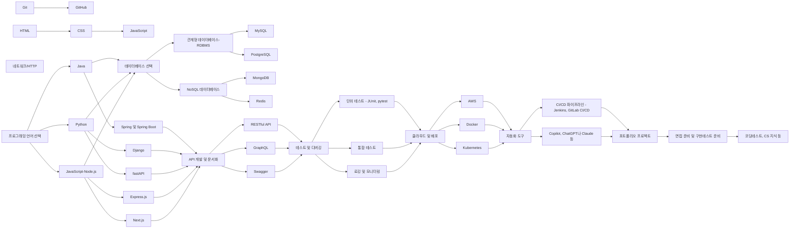

# backend-developer-guide
- 백엔드 개발자 가이드 입니다. frontend-developer-guide 레파지토리와 한 쌍입니다.

## 0. 목차

- 1. 배우는 순서
- 2. 추천 기술 스택
  - 2.1. 통계자료
  - 2.2. 프로그래밍 언어
    - 2.2.1. Java
    - 2.2.2. Python
    - 2.2.3. JavaScript(Node.js)
  - 2.3. 데이터베이스
    - 2.3.1. 관계형 데이터베이스 (RDBMS)
      - 2.3.1.1. MySQL
      - 2.3.1.2. PostgreSQL
    - 2.3.2. NoSQL 데이터베이스
      - 2.3.2.1. MongoDB
      - 2.3.2.2. Redis
  - 2.4. 프레임워크 및 라이브러리
    - 2.4.1. Spring 및 Spring Boot (Java)
    - 2.4.2. Django 및 fastAPI (Python)
    - 2.4.3. Express.js 및 Next.js (Node.js)
  - 2.5. API 개발 및 문서화
    - 2.5.1. RESTful API
    - 2.5.2. GraphQL
    - 2.5.3. Swagger
  - 2.6. 버전 관리 시스템
    - 2.6.1. Git
    - 2.6.2. GitHub
  - 2.7. 테스트 및 디버깅
    - 2.7.1. 단위 테스트 (JUnit, pytest)
    - 2.7.2. 통합 테스트
    - 2.7.3. 로깅 및 모니터링
  - 2.8. 클라우드 및 배포
    - 2.8.1. AWS
    - 2.8.2. Docker
    - 2.8.3. Kubernetes
  - 2.9. 자동화 도구
    - 2.9.1. CI/CD 파이프라인 (Jenkins, GitLab CI/CD)
    - 2.9.2. (매우 중요) Copilot, ChatGPT나 Claude 등
- 3. 포트폴리오
  - 3.1. 프로젝트 선정
    - 3.1.1. 실무 관련성
    - 3.1.2. 기술적 도전
  - 3.2. 코드 품질
    - 3.2.1. 가독성 및 유지보수성
    - 3.2.2. 성능 최적화
    - 3.2.3. 테스트 커버리지
  - 3.3. 문서화
    - 3.3.1. README
    - 3.3.2. API 문서
    - 3.3.3. 데이터베이스 스키마
  - 3.4. 확장성 및 보안
    - 3.4.1. 스케일링 전략
    - 3.4.2. 인증 및 권한 부여
    - 3.4.3. 데이터 암호화
- 4. 면접 준비
  - 4.1. 기술 질문 대비
  - 4.2. 프로젝트 설명 연습
  - 4.3. 소프트 스킬 및 커뮤니케이션
  - 4.4. 커뮤니티 활동
  - 4.5. 스터디
  - 4.6. 책 출판
  - 4.7. 블로그 운영
  - 4.8. 유튜브 채널 운영
  - 4.9. 강의 제작
- 5. 지속적인 학습
  - 5.1. 최신 트렌드 파악
  - 5.2. 개인 프로젝트 및 실험
  - 5.3. 오픈소스 기여
- 6. 질의응답

## 1. 배우는 순서

## 2. 추천 기술 스택

위니브에서 사용하는 기술 스택은 다음과 같습니다. 기업마다 이러한 기술 스택이 상이하니 원하는 기업 리스트를 뽑고, 기술 스택을 파악하고, 해당 기술 스택을 타겟팅하여 학습하면 좋습니다.

- 백엔드
  - Python 진형
  - Django
  - FastAPI
  - JavaScript 진형
  - Node.js
  - Express
  - DB
    - MongoDB
    - PostgreSQL
    - MySQL
    - Redis
  - Docker
  - AWS
  - CI/CD
    - GitHub Actions
- 프론트엔드
  - HTML/CSS
    - sass/scss
  - JavaScript
    - TypeScript(일부 오픈소스 프로젝트에서만 사용)
  - 프레임워크 및 라이브러리
    - React
    - Next.js
- 디자인
  - Figma
- AI
  - Copilot
  - Claude(chaptGPT를 사용하지 않습니다.)

### 2.1. 통계자료

프론트엔드 개발자가 되기 위해 어떤 기술 스택을 배워야 할지 결정할 때, 업계 통계자료를 참고하는 것이 도움될 수 있습니다. 인기 있는 기술일수록 커뮤니티 지원, 학습 자료, 취업 기회 등이 풍부하기 때문입니다. 대표적인 통계자료로는 `Stack Overflow Developer Survey`, `프로그래머스 개발자 설문조사` 등이 있습니다.

## 3. 포트폴리오

포트폴리오는 개발자의 실력과 경험을 증명하는 중요 자산입니다. 면접관은 포트폴리오를 통해 지원자의 기술 스택, 문제 해결 능력, 코드 품질, 커뮤니케이션 능력 등을 종합적으로 평가합니다.

위니브에서는 기술 면접시 포트폴리오 코드를 보고 그 코드에 대해 질문합니다.

### 3.1. 프로젝트 선정

포트폴리오에 포함할 프로젝트를 선정할 때는 실무 관련성과 기술적 도전 두 가지 측면을 고려해야 합니다. 

위니브에서는 프론트엔드 개발이나 백엔드 개발 파트로 지원하시는 분들은 기획이나 아이디어를 중요하게 판단하진 않습니다. 또한 PM으로 지원하는 경우 문서화나 시각화를 중요하게 판단합니다. 계획대로 프로젝트가 이뤄졌는지도 함께 판단합니다. 같은 선상에서 백엔드 개발 파트의 포트폴리오에서 프론트엔드 부분을 높게 평가히지 않고 프론트엔드 개발 파트의 포트폴리오에서 백엔드 부분을 높게 평가하진 않습니다. 다만 직무 외의 역량이 역시나 가산점은 됩니다.

#### 3.1.1. 실무 관련성

실제 업무에서 마주할 수 있는 문제를 해결한 프로젝트를 선택하면 면접관에게 좋은 인상을 줄 수 있습니다. 예를 들어, 상거래 사이트, 소셜 미디어 앱, 대시보드 등 다양한 도메인의 프로젝트를 포함하는 것이 좋습니다.

사용자의 피드백을 받아 반영한 경험이 있거나 트래픽이 어느정도 확보된 프로젝트라면 더 높은 평가를 받으실 수 있습니다.

#### 3.1.2. 기술적 도전

기본이 되어 있으신 분들은 기술적으로 도전적인 프로젝트를 선택하는 것이 좋습니다. 최신 기술을 활용하거나, 성능 최적화, 보안, 접근성 등의 이슈를 해결한 프로젝트를 통해 자신의 역량을 어필할 수 있습니다.

이러한 이슈는 꼭 `README.md` 파일에  이슈사항에 기록해주세요.

### 3.2. 코드 품질

깨끗하고 효율적인 코드를 작성하는 것은 개발자의 핵심 역량입니다. 코드 중 권고사항에 맞지 않거나 주석이 써있지 않거나, 비효율적인 코드를 작성하였을 경우에는 기술 면접 질문에서 질문합니다.

다음 항목들을 고려하여 코드 품질을 높이세요.

#### 3.2.1. 가독성 및 유지보수성

변수, 함수, 컴포넌트의 이름을 명확하게 짓고, 일관된 코딩 스타일을 유지하세요. 주석을 적절히 사용하고, 코드를 모듈화하여 재사용성을 높이는 것도 중요합니다.

#### 3.2.2. 성능 최적화

불필요한 렌더링을 피하고, 메모이제이션, 지연 로딩 등의 최적화 기법을 활용하세요. 번들 크기를 줄이고, 이미지와 폰트를 최적화하여 로딩 속도를 개선할 수 있습니다.

#### 3.2.3. 테스트 커버리지

유닛 테스트, 통합 테스트, E2E 테스트 등을 작성하여 테스트 커버리지를 높이세요. 테스트 자동화를 통해 회귀 버그를 예방하고, 코드 리팩토링을 안전하게 진행할 수 있습니다.

### 3.3. 문서화

프로젝트의 문서화는 코드 못지않게 중요합니다. 다음 항목들을 포함하여 체계적으로 문서화하세요.

#### 3.3.1. README

프로젝트의 개요, 설치 및 실행 방법, 주요 기능, 기술 스택 등을 README에 명시하세요. 프로젝트의 첫인상을 결정짓는 중요한 문서입니다.

샘플로 만들어둔 링크를 참고하세요. 보통 신입사원 이력서는 이정도의 포트폴리오가 3건 정도 작성됩니다. 특히 팀 프로젝트의 경우 상세하게 작성하시는 것을 권합니다.

링크: https://github.com/weniv/project_sample_repo

#### 3.3.2. 기술 선택 이유

프레임워크, 라이브러리, 도구 등을 선택한 이유를 질문합니다. 가장 많이 하는 질문 중 하나는 리엑트에 리덕스 사용 이유인데요. 리덕스를 사용하기에는 너무 작은 프로젝트일 때 이러한 질문을 하곤 합니다. Context API는 고려해봤는지, 리코일이 좀 더 적합하지 않은지 등을 질문합니다. 기술 선택의 장단점을 파악하고 있다는 점을 어필할 수 있어야 합니다.

#### 3.3.3. 프로젝트 구조 설명

프로젝트의 디렉토리 구조와 주요 파일의 역할을 설명하세요. 프로젝트를 처음 접하는 사람도 이해할 수 있도록 작성하는 것이 좋습니다.

### 3.4. 시각적 요소

프론트엔드 개발자는 사용자에게 최상의 경험을 제공해야 합니다. 다음 요소들을 고려하여 시각적으로 매력적인 애플리케이션을 만드세요.

#### 3.4.1. 사용자 경험 (UX)

직관적인 내비게이션, 일관된 레이아웃, 명확한 피드백 등을 통해 사용자 경험을 향상시키세요. 사용자 조사, 페르소나 설정, 프로토타이핑 등의 UX 디자인 프로세스를 활용할 수 있습니다.

#### 3.4.2. 반응형 디자인

다양한 화면 크기에 적응하는 반응형 디자인을 구현하세요. 미디어 쿼리, 플렉서블 박스, 그리드 시스템 등을 활용하여 모바일, 태블릿, 데스크탑에서 최적의 사용자 경험을 제공할 수 있습니다.

다만 모든 프로젝트에서 반응형을 대응하진 않습니다. 저희 회사에서 [위니북스](https://www.books.weniv.co.kr/)는 반응형으로 설계가 되어 있지만 [위니브월드](https://world.weniv.co.kr/)는 반응형으로 설계가 되어 있지 않습니다.

페르소나를 설정하여 어떤 사용자가 이용할지를 생각하고 디자인을 해야 합니다.

#### 3.4.3. 애니메이션 및 인터랙션

자연스러운 애니메이션과 인터랙션으로 사용자의 engagement(참여 또는 관여)를 높이세요. CSS 애니메이션, 트랜지션, SVG, 마이크로 인터랙션 등을 활용할 수 있습니다. 단, 과도한 애니메이션은 오히려 사용자 경험을 해칠 수 있으므로 주의해야 합니다.

## 4. 면접 준비

회사에 최적화된 면접 준비를 통해 면접관에게 좋은 인상을 남기고, 원하는 회사에 합격할 확률을 높일 수 있습니다.

면접을 보기 전 가능하면 회사 지인을 통해 커피챗을 먼저 하시는 것을 권합니다.

### 4.1. 기술 질문 대비

면접에서는 다양한 기술적인 질문이 주어질 수 있습니다. 자주 나오는 질문들을 정리하고, 모범 답변을 준비하세요. 기술 블로그, 책, 온라인 강의 등을 활용하여 지식을 심화하는 것도 좋습니다. 또한 실제 경험과 연결 지어 답변하면 더욱 설득력 있게 전달할 수 있습니다.

### 4.2. 프로젝트 설명 연습

포트폴리오에 있는 프로젝트를 매끄럽게 설명할 수 있어야 합니다. 프로젝트의 목표, 사용한 기술, 직면한 어려움과 해결 방법, 성과 등을 간단명료하게 전달하세요. 면접관의 추가 질문에도 대응할 수 있도록 프로젝트의 세부 사항을 숙지하는 것이 중요합니다.

### 4.3. 소프트 스킬 및 커뮤니케이션

기술력 못지않게 중요한 것이 소프트 스킬과 커뮤니케이션 능력입니다. 면접관은 지원자가 팀에 잘 융화될 수 있는지, 협업과 소통이 원활한지 등을 평가합니다. 모의 면접을 통해 자신의 생각을 논리적으로 전달하는 연습을 해보세요. 경청하는 자세, 긍정적인 태도 등도 훈련할 수 있습니다.

### 4.4. 커뮤니티 활동

개발자 커뮤니티에서 활발히 활동하는 것은 면접에서 큰 플러스 요인이 될 수 있습니다. 밋업, 컨퍼런스 등에 참여하여 인사이트를 얻고 인맥을 쌓으세요. 오픈소스 프로젝트에 기여하거나, 기술 관련 질문에 답변하는 것도 좋은 방법입니다.

컨퍼런스에서 발표한 내용이 있다면 이력서에 꼭 기술하시길 바랍니다. 위니브에서는 다음과 같은 컨퍼런스를 진행하고 연사 기회를 제공합니다.

- 제주 웹 컨퍼런스(https://jejuweb.kr/)
- 제주 AI 컨퍼런스(https://jejuai.kr/)

### 4.5. 스터디

혼자 공부하는 것도 중요하지만, 스터디를 통해 동료들과 함께 성장할 수 있습니다. 기술 스터디, 알고리즘 스터디, 프로젝트 스터디 등 다양한 주제로 스터디를 진행해보세요. 면접에서 스터디 경험을 어필하면 자기주도적 학습 능력과 협업 능력을 보여줄 수 있습니다.

### 4.6. 책 출판

기술 서적을 집필하는 것은 해당 분야에 대한 전문성을 입증하는 효과적인 방법입니다. 출판사와 협업하여 책을 출간하거나, 전자책을 자체 제작하여 배포할 수 있습니다. 책 출판 경험은 면접에서 차별화된 강점으로 작용할 수 있습니다.

또 이러한 기술 서적 출판은 밀도있는 개발자가 되기 위한 좋은 방법 중 하나입니다. 저희는 분기별로 출판을 지원합니다.

### 4.7. 블로그 운영

기술 블로그를 운영하면 자신의 지식을 체계적으로 정리하고 공유할 수 있습니다. 이렇게 정리된 글이 미래의 나를 먹여살리거나 가르치기도 합니다.

포스팅을 통해 문제 해결 과정, 새로운 기술 학습, 개발 경험 등을 기록하세요. 블로그는 개발자로서의 성장 과정을 보여주는 포트폴리오이자 플랫폼입니다.

블로그 같은 것을 사용하신다면 위니블로그(https://blog.weniv.co.kr/) 같은 것으로 정리하시면 좋습니다. 글을 올리면서 잔디도 심을 수 있습니다.

다만 이러한 블로그 글이 몇개 되지 않을 경우 이력서에 적지 않는 것이 좋습니다.

### 4.8. 유튜브 채널 운영

영상 콘텐츠를 통해 기술을 설명하고 노하우를 전달할 수 있습니다. 튜토리얼, 강좌, 리뷰, 인터뷰 등 다양한 포맷의 영상을 제작해보세요.

이러한 채널 운영은 개발자로서의 전문성을 높이는 것과는 별도로 면접에서 큰 도움이 될 수 있습니다.

### 4.9. 강의 제작

강의 제작 경험은 지식 전달 능력과 리더십을 어필할 수 있는 소재가 될 수 있습니다.

위니브에서는 학생이나 현업자 분들과 함께 강의를 제작하고 있습니다. 강의를 만들었던 이력을 발판삼아 취업이 되는 경우도 종종 있습니다.

## 5. 지속적인 학습

프론트엔드 개발은 빠르게 발전하는 분야이므로 지속적인 학습이 필수적입니다. 새로운 기술과 도구를 익히고, best practice를 따라가려는 노력이 필요합니다. 지속적 학습을 통해 개발자로서의 성장과 경쟁력을 유지할 수 있습니다.

### 5.1. 최신 트렌드 파악

최신 기술 트렌드를 파악하고 학습하는 데 힘쓰세요. 기술 블로그, 뉴스레터, 컨퍼런스 영상 등을 통해 새로운 정보를 얻을 수 있습니다. 주요 프레임워크와 라이브러리의 업데이트 내용도 꾸준히 체크하는 것이 좋습니다. 최신 트렌드를 이해하고 적용하면 개발 생산성과 퍼포먼스를 높일 수 있습니다.

한국에도 유명한 웹 컨퍼런스가 많습니다. 저희 회사에서도 이러한 컨퍼런스 참여를 독려하고 지원하고 있습니다. 또한 매일 기술 뉴스 클리핑을 통해 최신 기술에 대한 소식을 가장 빠르게 내부 전파 받을 수 있도록 체계화 해두었습니다.

위니브에서는 제주 웹 컨퍼런스를 통해 이러한 기술 교류가 일어나도록 노력하고 있습니다.

#### 5.1.1. 기술 블로그 및 뉴스레터 구독

[GitHub Blog](https://github.blog/), [Mozilla Hacks](https://hacks.mozilla.org/), [web.dev](https://web.dev/) 등 유명 기술 블로그를 구독하고 게시물을 읽어보세요. [Frontend Focus](https://frontendfoc.us/), [JavaScript Weekly](https://javascriptweekly.com/) 등 뉴스레터를 통해 최신 소식을 이메일로 받아볼 수도 있습니다.

#### 5.1.2. 컨퍼런스 및 밋업 참석

[Google I/O](https://events.google.com/io/), [Facebook F8](https://f8.com/), [JSConf](https://jsconf.com/) 등 대형 컨퍼런스에 참석하여 최신 기술 동향을 파악하세요. 오프라인 밋업이나 온라인 세미나에 참여하는 것도 좋은 방법입니다. 컨퍼런스와 밋업은 지식 습득과 더불어 네트워킹의 기회가 되기도 합니다.

### 5.2. 개인 프로젝트 및 실험

배운 내용을 개인 프로젝트에 적용해보는 것은 학습 효과를 높이는 좋은 방법입니다. 관심 있는 주제로 토이 프로젝트를 진행하거나, 새로운 기술을 실험해보세요. 이를 통해 실무에서 활용할 수 있는 역량을 쌓을 수 있습니다.

#### 5.2.1. 토이 프로젝트

간단한 아이디어로 토이 프로젝트를 시작해보세요. 일정 관리 앱, 날씨 앱, 투두리스트 등 만들고 싶은 서비스를 직접 구현해보는 것이 좋습니다. 토이 프로젝트는 새로운 기술을 적용하고 테스트해볼 수 있는 좋은 기회입니다.

#### 5.2.2. 기술 실험

최신 기술을 실제로 사용해보며 장단점을 파악해보세요. 예를 들어 CSS-in-JS, SVG 애니메이션, PWA 등 관심 있는 기술을 선택하여 간단한 예제를 만들어볼 수 있습니다. 기술 실험을 통해 best practice를 익히고 실무에 활용할 수 있는 노하우를 쌓을 수 있습니다.

### 5.3. 오픈소스 기여

오픈소스 프로젝트에 기여하는 것은 개발 실력 향상과 커뮤니티 경험 측면에서 많은 도움이 됩니다. 자주 사용하는 라이브러리의 이슈를 해결하거나, 새로운 기능을 추가해보세요. 오픈소스 활동은 협업 능력과 문제 해결 능력을 보여줄 수 있는 좋은 사례가 될 수 있습니다.

#### 5.3.1. 버그 픽스 및 기능 추가

사용 중인 오픈소스 라이브러리에서 버그를 발견했다면 직접 수정해보세요. 필요한 기능이 있다면 직접 구현하여 Pull Request를 보내는 것도 좋습니다. 코드 리뷰 과정에서 다른 개발자들과 소통하며 배울 점을 찾을 수 있습니다.

#### 5.3.2. 문서 번역 및 작성

오픈소스 프로젝트의 문서를 번역하거나 작성하는 것도 의미 있는 기여입니다. 한글 문서가 부족한 프로젝트를 찾아 번역 작업을 해보세요. 또는 초보자를 위한 가이드, 튜토리얼 등을 작성하여 프로젝트에 기여할 수 있습니다.
